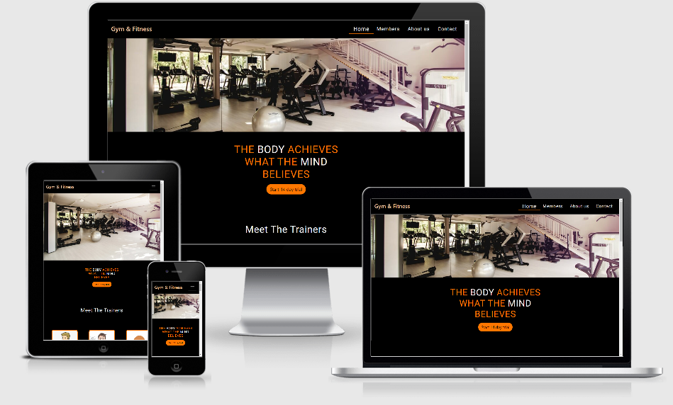
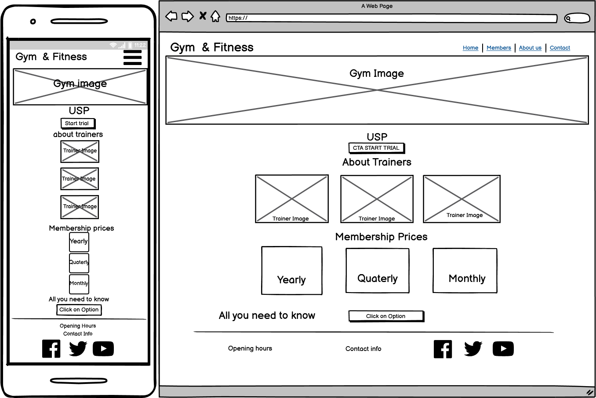
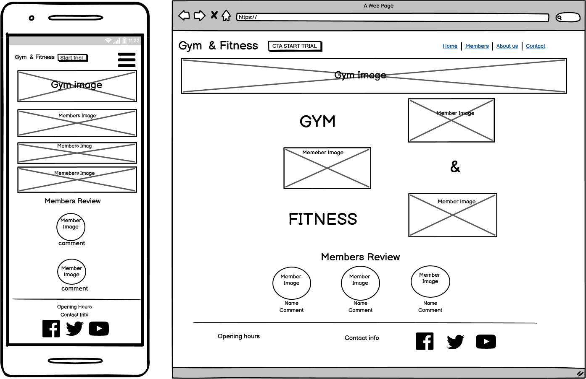
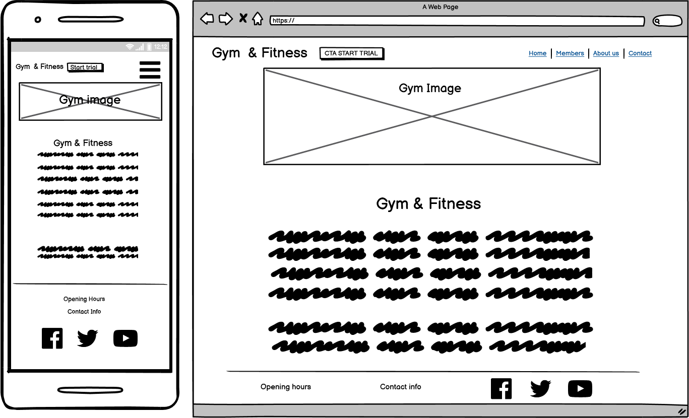
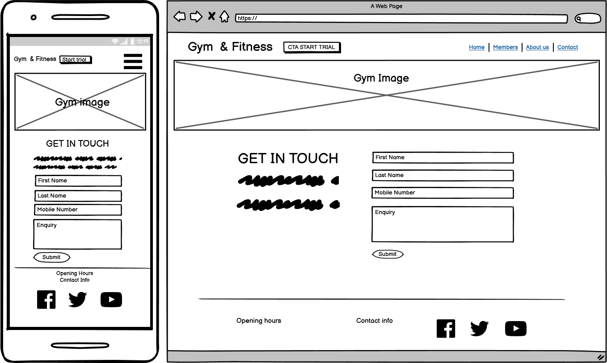

# milestone-project-1

### [View Live Site Here](https://tashi-sk.github.io/Gym---Fitness)

## THE GYM & Fitness

Purpose is to design a website with useful information to I'ts users using HTML, CSS and Bootstrap
that I have learnt from Full Stack Developer Code Institute Course.

I have produced a website for fictious Gym. It is for a small independent gym.

The owners aim of this site is to promote their services and attract customers.
The owner wants that data is managable and presentable in a way to help them achieve their goals.

### User Experience (UX)

#### Business Objectives

Create an online presence for Gym and Fiteness which will attract the new users for the gym or current members can browse and 
get in touch if they are interested in any of the service or contact the management regarding thier membership.

- #### Home

- #### Members

- #### About us 

- #### Contact 

### USER STORIES

1. John just moved to the new area and is looking for a gym. He is interested in Membership costs, opening times and location.

2. Sarah Is already a member in the gym and her membership is about to end. She is looking to change her current membership plan to a different plan.

3. Mark has heard about the gym from a friend, but want's to know more before he decides to join.

### Business Owner Stories
1. As a business owner I want to present my work in a professional, creative and visually appealing way.
2. As a business owner I want to generate interest in my services so that I can increase sales.
3. As a business owner I want to provide a good user experience for my customers, so that they want to come back.
4. As a business owner I want my customers to be able to contact me so that I can assist them with any enquiries they may have.

### Structure

#### Interaction Design:
User interactions will be intuitive and allow for easy navigation throughout the site. For mobile devices this will use a combination of a collapsed navigation menu and buttons on the home page to encourage user interaction with the rest of the site. For larger devices a fixed top navigation menu will provide clear and easy access to all other pages.

#### Information Design:
Will allow for the prioritisation of the information to be displayed in a clear and concise manner to make it as easy as possible for the user to read and to quickly find the information that is most relevant to their needs.

### FEATURES

#### NAVBAR

- Allow users to navigate to each page of the site. This is the same on each page aside from the active page setting.
I utilized bootstrap navbar components and CSS to construct this.

#### HOME PAGE
- The aim for this page is to attract and keep customers interested. At the top i Inserted Gym picture.
- I added a button link to the Contact form - which includes 14 day trial as a text on it. it has a background color and hover effect to match with the page theme. 
- Below this is Gym Trainer pictures with mouse over scale up effect i created this using CSS.
- Next I added a membership price cards with mouse over effect, scale up effect using CSS.
- By clicking on any price card user can send request to sign up on certain membership plan.
- There is best Value tag on Yearly Membership plan. I have used position property to position it.
- On this page I have made use of the bootstrap grid to allow items to be displayed nicely on differnt devices.
- It is Important that the service user can easily navigate and access neceserry details so i have added
 a location and contact information on the fotter.
- There is 'All You Need To Know' section for users to answer their general queries regarding gym. I used Collapse (accordion) effect from bootstrap.

### Footer 
- It was important for the user to find the information that they are after as quickly as possible and so I have included the location and contact information on footer. which is displayed on bootom of every page.
- it also have social media icons if user want to follow the gym on social networks.

### MEMBERS
- The aim of this page is to provide Gym members pictures using Gym and Equipment.
- There you can find Members reviews.
-On this page I have made use of the bootstrap grid to allow items to be displayed nicely on differnt devices.

### ABOUT PAGE

- The aim of this Page is to tell service user more about the Gym and its service rules and regulations. Also it provides the details about the location, size of the Gym,
 Wifi availability,parking space, Showers, Cafe and Other facilities available at the Gym. 

### Contact 
- gym staff picture on top.
- i have provided contact form using bootstrap to allow user to be contacted.

### Features Left to Implement

- Make form function. -Improve Membership Page: Make images display more stylishly and add videos.
- Provide timetable on the about us. have the membership plan information available.
- Provide members to submit thier comment and ratings online. 

### Technologies Used
- The site was developed with HTML5 and CSS3 using Github/Gitpod website to code. 
- Bootstrap v4.5.3 https://getbootstrap.com/ was used to create structure, navigation, forms and buttons. 
- fontawesome https://fontawesome.com/ was used to create the social media Icons.
- Google fonts are used throughout the project to import the Roboto fonts.
- Google chromes built in developer tools are used to inspect page elements and find the issues with the site layout and test different CSS styles.
- Balsamiq Wireframes was used to create wireframes for 'The Skeleton Plane' stage of UX design.
- Lighthouse, a Google Web Dev tool, was used for testing performance, accessability, best practices and SEO of the site in it's entirety.
- Javascript/Query is used by Bootstrap for the modals and Navigation collapse icon.
- https://www.Tinypng.com is used for compressing images.
- https://jigsaw.w3.org/css-validator/ - Used to validate code.
- https://validator.w3.org/ - Used to validate code.

### TESTING

#### Links & Buttons Testing:

Logo links to home-page this was tested manually from each page of the website. 

Navigation Menu links – Home, Members, About us, Contact were all individually manually tested from each page of the website to ensure the user is directed to the correct page.

Membership price cards were tested manually to ensure they direct the user to the sign up form.

Start 14 days trial button was tested manually to ensure they direct the user to the Sign up form.

Social Media links in the footer of each page were tested manually to ensure they direct the user to the correct page. As currently the business does not have any active social media sites these links point to the main page for each platform eg. twitter.com etc.

#### Form Testing:

Tested the submit button with no input fields filled in to ensure the form would not submit without the required fields filled in.

Tested the Email field to ensure the form will not submit if an invalid entry is made in this field.

Tested submitting the form without one of each of the required fields and the form will not submit without all required fields filled in.

#### Device testing:

All aspects of the website mentioned above were manually tested on the following devices:
iPad Pro 2, iPhone se, Samsung Note 9, Huawei P30 pro and Laptop.

#### Browser Testing:

All aspects of the website mentioned above were manually tested on the following browsers:
Chrome, Safari, Mozilla Firefox

https://validator.w3.org/ was used to determine html5 and css3 if any issues in the code. 
Throughout the developement I was checking my code to see if it performed as I was expecting. 
I mostly used Google Chrome for this. I used the developer tools to check and analyse the view, functionality and user experience in different screen sizes and device simulations.

#### Testing User Stories

1. John just moved to the new area and is looking for a gym. He is interested in Membership costs, opening times and location.

    - John can find the address, location and membership details on the 'Home Page'. From Home page He can easily acces members page
    to view service users reviews and also click on 'About Us' page to read in detail about the gym.

2. Sarah Is already a member in the gym and her membership is about to end. She is looking to change her current membership plan to a different plan.
    - The phone number of the gym is available on the footer of every page if she wishes to contact the gym.

3. Mark has heard about the gym from a friend, but want's to know more before he decides to join.
    - A members page includes gallery of people using gym and equipment and read reviews from other users.
    - This members page can be accesed on right side on top of the page.
    - There are pictures and reviews from members, it will hopefully give a great impact and make Mark join the Gym.

#### Testing Business Owner Stories

1. As a business owner I want to present my work in a professional, creative and visually appealing way.
    - Professional website.
    - Image galleries to show the presence of place.

2. As a business owner I want to generate interest in my services so that I can increase sales.
    - Membership categories are easy to find to for user to decide which service they want.
    - Contact form so potential customers can get in touch and discuss a product or custom design.
    - Social media links provided on all pages to encourage interaction with customer base.

3. As a business owner I want to provide a good user experience for my customers, so that they want to come back.
    - Professional look and a friendly feel to the website.
    - Visually appealing throughout.
    - Intuitive and easy to navigate around site.
    - Future releases to add more features and content to keep users interested and offer something new to returning users.

4. As a business owner I want my customers to be able to contact me so that I can assist them with any enquiries they may have.
    - Contact page is provided.
    - Contact page is easily accessible from contact link on website via the navigation menu.
    - The contact form is simple and easy to use.
    - Social media links are also provided in the footer of each page should users prefer to interact over social media.

### Design
#### Color scheme
##### Combination of color below is used in making this site.
- #f6f6f6
- #000 
- rgb(41, 76, 153)
- #ff7700 

### Fonts
- Roboto, fonts have been used through out the design of this site.

### Deployment

This website was created in the Gitpod development environment. After installing the Gitpod extension for Chrome web browser and creating a new repository in GitHub using the Code Institute template, the green Gitpod button was used to initialise the repository in Gitpod. Throughout the process the git commands git add and git commit were used to store the work in the local Gitpod environment, git push would then be used to push the commits to the GitHub repository. From here the website could then deployed to Git Pages:

#### Git Hub Pages:

From the Git Hub repository:

   - Go to settings
   - Scroll down to Git Hub Pages section
   - Select branch to be deployed, in this case the master branch
   - Click Save

### Creating A Local Clone:
You can clone the repository to create a local copy on your computer.

From the Git Hub repository:

   - Click Code at the top of the file list
   - Click the clipboard icon to copy the url provided

Open terminal:

   - Change the current working directory to where you want the cloned directory to be
   - Type git clone and paste the copied url after it
   - Press enter and the clone will be created

### Credits

- Bootstrap Nav Bar with Links. Bootstrap navbar used with some modifications.
-  The text on the Home page Title section is taken from google search.
	"the body achieves what the mind believes"
- button text "start 14 day trail" is taken from https://fiit.tv/pricing.
- The text and style of membership price plans is taken from https://fiit.tv/pricing. 
- above the footer on home page the All you need to know heading and the Questions and answers is taken from https://fiit.tv/pricing.
- member reviews rating concept is take from www.google.com search reviews concept for a website.

### Media 

As this is not a fully functioning site I just selected images that i liked from a 

- https://google.com image search
- https://unsplash.com
- https://pexels.com

### Acknowledgements

-  Special thanks to my mentor **Spencer Barriball** who reviewed my project and pointed out potential mistakes in my project.
-  I received inspiration for this project from:
   * https://fiit.tv/
